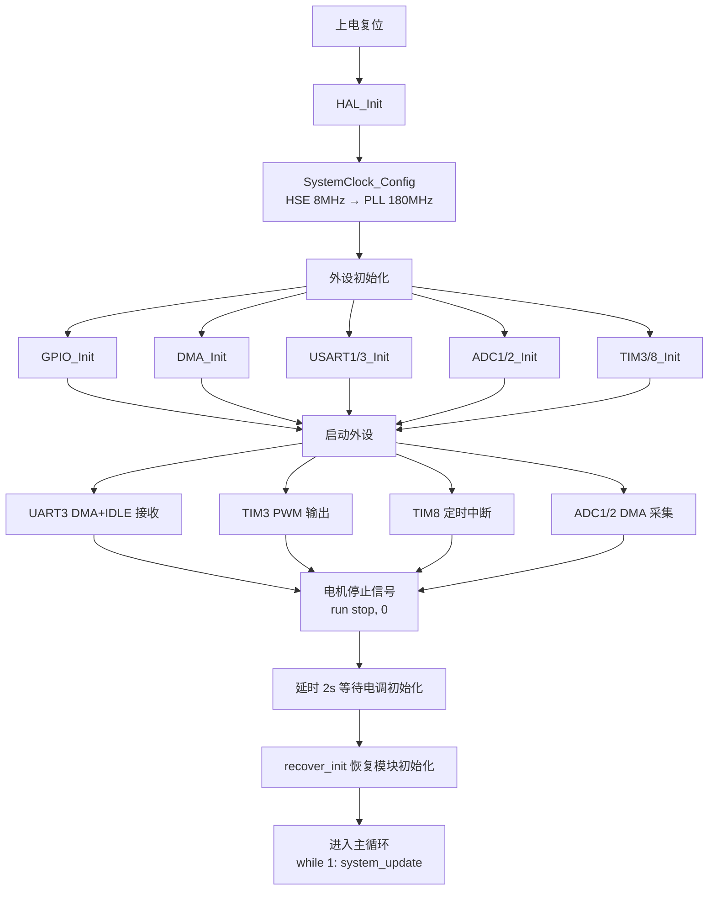
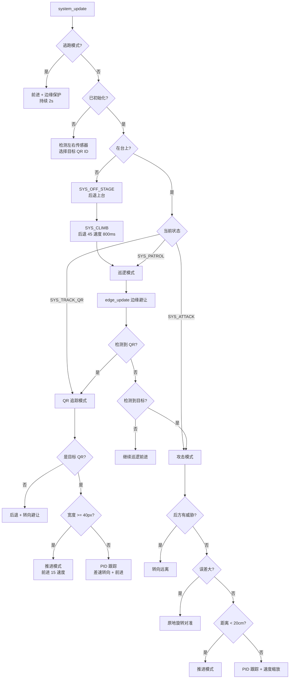
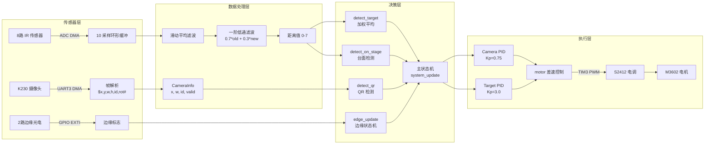
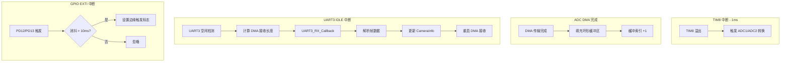
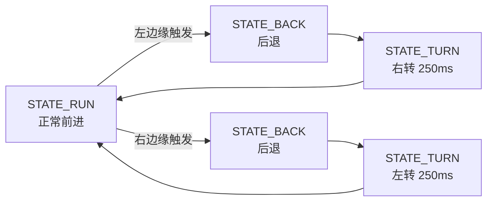

中国大学生机器人智能创意竞赛机器人对抗赛A组无人对撞小车代码部分，以及一部分结构和硬件部分。Vscode和Keli两种编译器均可编译.

# STM32 对战机器人工程说明

## 1. 项目概述

基于 STM32F427VGT6 的自主对战机器人，采用裸机（无 RTOS）架构，通过 8 路红外传感器 + K230 摄像头实现目标检测与追踪，使用 PID 控制差速驱动完成自主攻击、巡逻、避障等行为。

## 2. 硬件平台

| 模块 | 型号/参数 |
|------|-----------|
| MCU | STM32F427VGT6 (Cortex-M4, 180MHz) |
| 电机 | M3602 有刷电机 (22.2V) |
| 电调 | S2412 (PWM 控制) |
| 红外传感器 | 8 路 IR 测距 (5-80cm) |
| 摄像头 | K230 (160×120, AprilTag 检测) |
| 边缘传感器 | 2 路光电开关 (PD12/PD13) |

## 3. 工程目录结构

```
Car_Test/
├── Core/
│   ├── Inc/              # HAL 外设头文件
│   └── Src/              # HAL 外设实现 + main.c
├── Components/BSP/       # 自定义驱动层
│   ├── system.c/h        # 主状态机 & 战斗逻辑
│   ├── motor.c/h         # 电机 PWM 控制
│   ├── sensor.c/h        # IR 传感器 ADC 采集
│   ├── camera.c/h        # K230 摄像头 UART 通信
│   ├── edge.c/h          # 边缘检测 & 防跌落
│   ├── pid.c/h           # PID 控制器
│   ├── recover.c/h       # 跌落恢复逻辑
│   └── BSP_USART.c/h     # 串口 printf 重定向
├── Drivers/              # STM32 HAL & CMSIS 库
├── K230_Code/            # K230 摄像头端 Python 代码
└── STM32F427VGT6.ioc    # CubeMX 工程文件
```

## 4. 外设分配

| 外设 | 用途 | 配置 |
|------|------|------|
| UART1 | 调试串口 | 115200, 中断接收 |
| UART3 | K230 摄像头通信 | 115200, DMA + IDLE 中断 |
| TIM3 CH1/CH2 | 电机 PWM 输出 | PSC=900, ARR=2000 (~100Hz) |
| TIM8 | 1ms 定时中断 | 触发 ADC 采样 |
| ADC1 (4ch) | IR 传感器 0-3 | DMA 循环采集 |
| ADC2 (4ch) | IR 传感器 4-7 | DMA 循环采集 |
| GPIO PD12/PD13 | 边缘光电开关 | EXTI 中断 + 10ms 消抖 |

## 5. 系统初始化流程图



## 6. 主循环状态机流程图



## 7. 数据流图



## 8. 中断服务流程



## 9. 边缘检测状态机



## 10. 关键参数一览

| 参数 | 值 | 说明 |
|------|-----|------|
| CAMERA_IMAGE_WIDTH | 160 | AprilTag 图像宽度 |
| CAMERA_PID_DEADZONE | 8 | 跟踪软死区 (像素) |
| TARGET_THRESHOLD | 40cm | IR 目标检测距离 |
| EDGE_TURN_MS | 250ms | 边缘避让转向时间 |
| RECOVER_HOLD_MS | 800ms | 跌落恢复保持时间 |
| ESCAPE_DURATION | 2000ms | 逃跑模式持续时间 |
| Camera PID | Kp=0.75, Ki=0.01, Kd=0.2 | AprilTag 跟踪 PID |
| Target PID | Kp=3.0, Ki=0.0, Kd=1.2 | 红外目标跟踪 PID |
| PWM 基准值 | 150 | 电调中位值 (100-200) |

## 11. K230 摄像头通信协议

**帧格式**: `$x,y,w,h,id,rotation#`

- `$` 帧头, `#` 帧尾
- 逗号分隔的 6 个字段
- STM32 端提取 `x`(位置), `w`(宽度), `id`(AprilTag ID)
- 有效期 100ms，超时标记为无效


**摘 要**

本报告根据赛题要求，设计了一款简易轮式格斗机器人。该机器人以 STM32F427VGT6 为主控核心，集成红外测距模块、红外光电传感器及K230视觉摄像头，实现登台巡台、自主寻敌攻击、二维码识别与防掉台等功能。系统通过红外测距模块采集环境信息，经主控处理后，采用 PID 控制算法驱动小车运动，实现敌方目标的自动识别与攻击，以及掉台后的自主登台复位；K230 摄像头通过串口通信向主控传输识别结果，实现己方、敌方及中立方块的区分，为攻击与躲避策略提供依据；当红外光电传感器检测到擂台边缘时，将产生下降沿触发中断，执行防掉台保护程序，保障机器人稳定运行。

实验测试表明，该装置可稳定完成各项预设功能，响应速度快，抗干扰能力强，满足格斗机器人的实战需求。

**关键词：**轮式格斗机器人；STM32F427VGT6；PID控制；红外测距；K230视觉识别

**目 录**

[摘 要 1](#_Toc227417951)

[1\. 作品概述 3](#_Toc227417952)

[1.1 核心功能设计 3](#_Toc227417953)

[1.2 尺寸与重量设计 3](#_Toc227417954)

[1.3 安全性设计 4](#_Toc227417955)

[1.4 赛场工作流程 4](#_Toc227417956)

[1.5 创新点 4](#_Toc227417957)

[2\. 整体设计方案 5](#_Toc227417958)

[2.1 系统方案 5](#_Toc227417959)

[2.2 机械机构 6](#_Toc227417960)

[2.2.1 机械框架 6](#_Toc227417961)

[2.2.2 轮毂部分 8](#_Toc227417962)

[2.3 物料清单 9](#_Toc227417963)

[3\. 硬件系统 9](#_Toc227417964)

[3.1 控制器 9](#_Toc227417965)

[3.2 传感器 10](#_Toc227417966)

[3.3 电源 11](#_Toc227417967)

[3.4 驱动模块 12](#_Toc227417968)

[4\. 软件算法 12](#_Toc227417969)

[4.1 整体程序设计 12](#_Toc227417970)

[4.2 视觉识别 13](#_Toc227417971)

[4.3 运动控制 13](#_Toc227417972)

[4.3.1 AprilTag追踪控制 14](#_Toc227417973)

[4.3.2 目标追踪控制 15](#_Toc227417974)

[4.4 决策逻辑 16](#_Toc227417975)

[4.4.1 边缘检测 17](#_Toc227417976)

[4.4.2 掉台后登台决策 17](#_Toc227417977)

[4.5 状态机设计 17](#_Toc227417978)

[4.5.1 System主状态机 17](#_Toc227417979)

[4.5.2 Edge子状态机 18](#_Toc227417980)

[4.5.3 Climb子状态机 18](#_Toc227417981)

[4.5.4 Avoid 子状态机 19](#_Toc227417982)

[5\. 功能测试和调试 19](#_Toc227417983)

[5.1 各模块测试 19](#_Toc227417984)

[5.1.1 距离传感器测试 19](#_Toc227417985)

[5.1.2 电机测试 21](#_Toc227417986)

[5.2 整体联调 21](#_Toc227417987)

[5.3 问题与解决方案 22](#_Toc227417988)

[6\. 总结与展望 22](#_Toc227417989)

[附录： 23](#_Toc227417990)

1.  **作品概述**

本文针对中国高校智能机器人创意大赛轮式机器人格斗A赛项，设计一款轮式格斗机器人。机器人以自主感知、智能决策、稳定执行为核心设计目标，能够根据赛场环境完成多场景任务，同时严格满足竞赛规定的尺寸、重量与安全要求，具备稳定可靠、响应迅速、策略灵活的功能特点。

- 1.  **核心功能设计**

1）擂台台上台下自主识别。机器人通过传感器实时采集场地灰度信息与边界信号，可精准判断自身处于擂台之上或台下区域。由于台上格斗、台下复位的运动逻辑完全不同，台上台下状态识别是实现自主登台、防掉台、对抗攻击等功能的基础，对提升系统鲁棒性与任务连续性至关重要。

2）擂台下自主运动与登台。机器人在擂台下可自主识别过道区、边角区及出发区，依据场地特征完成路径规划，实现自主寻边、精准对位与平稳登台。掉落后无需人工干预即可快速返回擂台，有效减少失分，保障比赛持续进行。

3）擂台上稳定运动与高效策略执行。在擂台上，机器人通过边缘检测中断机制实现防掉台保护，确保运动安全。同时结合赛场态势规划最优行驶路线，在避免坠落、合理防御的前提下，最大化移动与攻击效率，为争夺能量块、对抗敌方机器人提供稳定支撑。

4）能量块识别与敌我目标区分。赛场能量块搭载 AprilTag 二维码，机器人通过 K230 视觉模块完成图像采集与目标识别，准确区分己方、敌方及中立方块。遵循 “不推己方、主动攻击敌方、争夺中立” 策略，避免因误推己方方块失分，优先推动敌方方块与中立方块获取积分。同时可识别敌方机器人，自主完成追击、冲撞、避让等攻防动作，实现最优得分策略。

- 1.  **尺寸与重量设计**

为满足比赛规则，机器人严格控制物理参数：初始放置状态整机投影尺寸不大于30cm×30cm，可完全置于出发区内；整机重量不超过4kg，兼顾动力性能与赛场合规性。

- 1.  **安全性设计**

机器人严格遵循安全竞赛原则，整体结构无尖锐边角、无刀刃、无发射及炸类装置，不使用火焰、液体、粘性或吸附式结构，不会对场地、裁判及对方机器人造成损坏与威胁。电气系统采用隔离供电、独立开关断电、过流保护及加固接线设计，接线可靠、抗震动、抗冲击，可在剧烈对抗与频繁碰撞下保持稳定运行。供电部分采用 21600 规格锂电池组，配置完善的充放电保护、过压保护与短路保护。同时，在控制程序中加入输出限幅与PWM 限幅操作，避免电机与驱动电路过载，进一步提升系统运行安全性。整体安全性能与结构设计均符合大赛安全声明要求。

- 1.  **赛场工作流程**

比赛场地由 2.4m×2.4m、高 6cm 的正方形擂台与台下区域组成，台面呈外侧纯黑至中心纯白渐变灰度。机器人从指定出发区启动后自主登台，在擂台上完成敌方识别、攻防对抗与能量块推动；掉落台下后自主复位重新登台，最终以积分高低判定胜负。本机器人可全程自主完成任务，响应时间短、抗干扰能力强，能够满足格斗对抗的实战需求。

- 1.  **创新点**

本文面向小型轮式机器人结构设计中的承载、防护与轻量化协同优化问题，提出一体化创新方案。首先，构建非承载式“底盘—车壳”分级架构，将动力承载与外部防护功能有效解耦，在降低装配误差累积的同时提升整体结构可靠性。其次，在连接设计上引入榫卯互锁机制，并结合“双L型”错位螺栓排布，实现界面剪切与多点受力的协同作用，从而有效分散冲击载荷并提高抗松动、抗失效能力。在此基础上，采用拓扑优化方法对结构进行轻量化重构，在保留主载荷传递路径的前提下，辅以加强筋布局与圆角过渡设计，以改善应力分布并提升刚度与抗疲劳性能。最后，针对轮毂系统，通过设置外侧加强筋增强胎面锚固效应以抑制高扭矩滑移，同时引入半嵌入式结构优化空间布局，从而进一步提升整车转向性能与抗侧翻稳定性。

1.  **整体设计方案**
    1.  **系统方案**

系统框图如下图所示。系统以 STM32F427VGT6 单片机为控制核心，整合电源供给、多传感器感知、电机驱动执行三大模块，构建面向格斗场景的闭环控制系统。

系统由22.2V直流稳压电源供电，其中主回路直接输出给M3602有刷电机，提供格斗所需的高扭矩动力；剩余能量经降压模块转换为3.3V、5V与12V，分别供给主控芯片、传感器及视觉模块，以满足不同硬件的电压需求。

在感知层，红外测距模块通过ADC模拟信号输入，向主控反馈敌方距离信息，辅助碰撞决策；红外光电传感器利用I/O接口实现擂台边缘检测，避免机体坠台；K230视觉摄像头通过串口通信，将识别到的目标特征（如敌我方块）数据传输至主控。

在决策与执行层，STM32F427VGT6主控接收并融合来自所有传感器的数据，经内部算法解算后，输出PWM控制信号至S2412电调，进而驱动M3602有刷电机运转。通过调整PWM占空比，精准控制电机的转速与转向，实现机器人的前进、后退、急转及冲撞等格斗动作，从而完成从环境感知、决策规划到运动执行的全流程闭环控制。

- 1.  **机械机构**

**2.2.1 机械框架**

在机械框架系统设计中，本项目摒弃了传统承载式设计的冗余，参考大量优秀汽车设计和对抗场景下的受力要求，转而采用非承载式汽车“底盘+车壳”的方案。这种架构将底盘定义为承载动力系统与主要机械载荷的骨架，而将车壳转化为专注转移外受力和次级吸能的功能性外壳。不仅减少部件之间的装配误差和制造误差带来的强度削弱，更简化了复杂系统的装配步骤。本车上车身使用3D打印增材制造，利用其一体化成型的特点，在零件层面消除了由于装配带来的应力突变点。

底盘和顶板部分作为整车的动力基座，选用了高模量的碳纤维复合材料板材，有效抑制驱动系统在高速旋转下产生的谐振，确保了动力传递的稳定。在连接处理上针对传统小车只使用螺丝紧固出现在撞击之后的自松动问题，引入了多重保障。首先，借鉴榫卯的机械互锁原理，在框架边缘与碳纤维板的接触面预设了凹槽。这种结构形成的“过盈互锁”，在遭受外部瞬间冲击时，撞击能量会优先通过接触界面的剪切应力进行耗散。本项目在前后分别使用“双L型”对称螺孔排布。该排布通过空间上的错位分布，扩大了连接副的有效受力矩，将单列支点的应力失衡有效转化为多点均衡分布的载荷场，彻底解决了单侧薄弱区的失效隐患，使整体框架在复杂动态工况下依然具备卓越的结构稳固性。 

在制造逻辑确定后，针对结构轻量化需求，采用SolidWorks拓扑优化识别并移除低应力区域，仅保留主载荷传递路径。为弥补材料削减带来的局部刚度下降，在大面积区域布置米字型加强筋与周期性排肋，有效提升面板抗失稳能力。同时，将边缘直角过渡优化为合理半径圆角，通过平滑曲率引导应力流，避免冲击过程中的应力集中与能量堆积，从而提高结构在交变载荷下的抗疲劳性能与整体可靠性。基于本项目所用M3602电机估算冲击载荷约为380 N，静应力分析结果表明结构实际形变量较小，处于毫米级范围内。

**2.2.2 轮毂部分**

在轮毂外侧，引入了对称加强筋列阵，通过增加轮毂基体与硅胶胎面的物理接触面积，建立起更高密度的“锚固效应”。显著提升了界面摩擦力的传导效率，有效抑制了在大扭矩启动下硅胶胎面的局部滑移，通过筋位分布优化了胎面的载荷分布，确保了动力输出的线性。

轮毂内部则采用了轻量化演进策略。利用拓扑分析，在动态模拟工况下精确识别出结构中的低应力“冗余区”并实施减重。为了补偿材料移除后的径向刚度损失，内部增设了变截面加强筋，这种“外刚内韧”的仿生骨架结构，在确保轮毂抗压强度的同时，极大降低了“簧下质量”。

考虑到转向效率随轮胎宽度上升而优化，本项目打破了传统联轴器外置的布局逻辑，创造性提出了一种全新的半嵌入式轮毂结构，将六角联轴器尽可能包在轮毂内，只留下最少的锁紧区间，在比赛30cm的规则内将轮毂宽度在理论上拉至最大值。为车辆提供了更强的纵向牵引力，更在高速转弯工况下通过更大的侧向支撑刚度，大幅优化了转弯效率与抗侧翻极限。如图xxx是普通轮胎设计，而图xxx是本项目的轮胎设计

- 1.  **物料清单**

|     |     |
| --- | --- |
| 模块或元件 | 获取方式 |
| 红外测距模块 | GP2Y0A21YK0F（10-80cm） |
| 红外光电传感器 | 红光漫反射型NPN输出STAB-WR40N |
| 电调  | S2412有刷电调24mos版本（Mechine创客工坊） |
| 有刷电机 | M3602 P30改款（Mechine创客工坊） |
| 单片机 | STM32F427VGT6核心板 |
| 电源  | 三星21700-50S（6串1并3\*2排列\[5000mah\]） |
| K230摄像头 | K230视觉模块（亚博智能） |
| 外接拓展板 | 自主设计 |
| 24V转12V降压板 | 自主设计 |

1.  **硬件系统**

该轮式机器人格斗A的硬件系统由控制器、传感器、电源及驱动模块四部分组成，各模块协同工作，保障机器人在格斗场景中的稳定运行与高效对抗，具体设计如下：

- 1.  **控制器**

本系统选用STM32F427VGT6作为主控芯片，其引脚分布如图所示。

图 STM32F427VGT6芯片引脚图

STM32F427VGT6芯片具备丰富的外设资源，包含多路通用输入输出引脚（GPIO）、模拟-数字转换模块（ADC）、通用异步收发传输器（UART）及多种定时器，核心主频可达180MHz。该芯片可满足轮式机器人格斗场景下多传感器接入需求，对外界环境及自身状态响应迅速，且性价比较高、可拓展性强，可充分适配格斗过程中快速响应的核心需求。

控制器部分由STM32F427VGT6最小系统板与自主设计的外部拓展电源板组成。考虑到格斗过程中，杜邦线直接连接存在接线繁琐、连接不牢固的问题，且最小系统板传感器供电引脚数量不足，无法满足多传感器的供电及信号传输需求，因此设计了一块集降压供电与接口拓展于一体的底板。

- 1.  **传感器**

根据赛题要求，系统共采用三种传感器，分别为红外测距模块GP2Y0A21YK0F、红光漫反射型NPN输出STAB-WR40N传感器及K230摄像头，各传感器分工明确、协同配合，满足格斗场景的各项检测需求：

（1）GP2Y0A21YK0F红外测距模块：主要用于巡敌攻击，其测距范围为10-80cm，该区间内线性度优良，可通过计算输出电压值获取精准距离，具备较强的抗干扰性与灵敏度，能够远距离检测敌方机器人并触发碰撞攻击指令。

（2）STAB-WR40N红光漫反射传感器：用于巡台边缘检测，响应时间小于500ms，反应速度快且检测距离可调，可在机器人接近擂台边缘时快速响应，控制机器人后退，避免掉台故障。

（3）K230视觉模块搭载嘉楠K230芯片，内置双RISC-V处理器及专用KPU，具备最高6TOPS算力，可高效完成敌方能量块识别，满足格斗场景下高速对抗与实时响应需求。模块支持MicroPython开发，依托CanMV生态，资料丰富，上手便捷；通过UART即可与STM32F427VGT6主控连接，接口简单，降低了系统集成难度。其硬件设计可靠，能够承受比赛中的震动与冲击，运行稳定，保障视觉系统长期可靠工作，同时具备良好的性价比。

- 1.  **电源**

结合赛题对机器人重量的限制及安全优先原则，系统采用一块额定电压22.2V、容量5000mAh的21700锂电池组作为主电源，专门为M3602有刷电机供电，具备较强的续航能力。该电池组还通过自主设计的降压电路（以TX4138为主芯片）将24V电压转换为12V，作为外接拓展电源板的输入电源。该降压板的电路原理图如图所示。其次，拓展底板将外部接入的12V电源，通过MP2315S芯片降压至5V、RT9013芯片降压至3.3V，分别为传感器、最小系统板等不同电压需求的器件供电。

- 1.  **驱动模块**

驱动模块由M3602有刷电机与S2412电调组成，二者协同为机器人提供强劲动力，适配格斗场景的激烈对抗需求：

（1）M3602有刷电机：相较于市面上小体积电机，具备扭矩大、功率高、重量轻的优势，其持续扭矩可达4.5NM，峰值扭矩可达12.5NM，最大功率可达580W，爆发力强、响应迅速、抗冲击能力突出，能够在激烈对抗中输出强劲且稳定的动力，为机器人争取格斗优势。

（2）S2412有刷电调：配备24mos管，响应时间仅为2ms，可实现毫秒级正反转切换，能够提供持续高负载输出，具备高效、可控性强的特点，可精准控制电机的转速与转向，保障机器人灵活走位与稳定运行。

1.  **软件算法**

**4.1 整体程序设计**

**4.2 视觉识别**

本系统的视觉识别模块基于K230嵌入式视觉平台构建，该平台拥有丰富的集成算法接口，结合平台自带的AprilTag视觉标记识别算法，实现对目标的实时检测与位姿信息提取。经测试，在160×120的分辨率下，摄像头能稳定且多角度的识别AprilTag，并且帧数稳定在45fps以上，完全符合本项目的要求。显示效果如图。。。

在图像采集与预处理方面，为减少环境噪声对识别结果的影响，采用高斯滤波对图像进行平滑处理，从而提升边缘检测与特征提取的稳定性。

在目标检测算法方面，系统对每帧图像执行AprilTag检测，提取所有候选标签，并依据面积最大原则选取主要目标，以减少多目标场景下的识别歧义；同时引入多帧一致性验证机制，通过连续帧标签ID匹配（阈值为3帧）确认有效目标，从而提高识别结果的稳定性并抑制瞬时误检与环境干扰。

在数据通信方面，系统获取目标的边界框信息（x, y, w, h）以及标签唯一标识ID，通过UART将识别结果按照自定义协议进行封装，并发送至STM32F4。该通信方式实现简单、延迟低，能够满足实时控制系统对数据传输的要求。

图

**4.3 运动控制**

对于AprilTag及敌方目标的动态追踪，系统采用PID闭环控制策略。通过对摄像头回传的目标位置信息及传感器数据进行融合分析，实时计算偏差信号，并动态调节电机输出，实现对目标的快速响应与稳定跟踪。

PID控制公式：

参数关系为，其中为控制器比例放大系数；为积分时间；为微分时间 _e(t)_为偏差信号。

PID控制主要分为位置式PID和增量式PID两种形式。其中，位置式PID直接计算当前时刻的控制量输出，具有实现简单、响应速度快的特点；而增量式PID输出的是控制量的增量，具有较好的抗干扰能力和数值稳定性。

位置式PID控制算法表达式为：

其中，为控制器在第次采样时刻的输出，为当前偏差，为误差累加项，用于消除稳态误差。

由于本系统的输入量多为离散性数据，并且要求有极高的实时性，故采用了位置式PID实现电机的控制。

**4.3.1 AprilTag追踪控制**

（流程图）

在AprilTag目标处理过程中，系统基于K230输出的位置信息与尺寸信息，构建以图像中心为参考的横向偏差信号，并通过PID控制实现左右轮差速调节，从而完成目标对准与稳定跟踪。

针对不同ID的AprilTag，系统采用差异化控制策略：当检测到非目标标签时，进入避让模式，通过反向运动结合差速转向实现快速规避，并在一定时间内对该目标进行锁定以防止误触发攻击；当检测到目标标签时，根据其在图像中的尺寸信息动态调整前进速度，实现由远及近的平滑接近，当尺寸达到设定阈值后切换至推送模式，通过双轮同速前进实现目标压制与推出。

为提升控制稳定性，在PID输出中引入软死区非线性调节机制，对小范围误差进行抑制，从而有效减少抖动并提高整体运动平滑性。

软死区非线性调节机制

**4.3.2 目标追踪控制**

（流程图）

在敌方目标攻击阶段，系统结合视觉识别结果与多路距离传感器信息，实现基于状态机的决策控制。首先，通过边缘检测模块对平台运行状态进行约束，当检测到边缘风险时优先执行避险动作，以保证系统不会轻易掉台。

在目标决策层，系统优先处理AprilTag信息，当存在需规避的AprilTag目标时立即切换至AprilTag追踪控制；否则进入敌方目标攻击流程。

对于后方物体，系统利用后方及侧后方距离传感器评估威胁，当后方威胁强度达到一定值（强度大于20）时，优先执行原地转向，以提升对抗环境中的生存能力。

后方威胁评估

在目标跟踪控制方面，根据目标偏差大小采用分段控制策略：当偏差较大时，系统执行原地差速转向以快速对准目标；当偏差较小时，结合PID控制进行前向差速调节，实现平滑逼近。

当目标进入近距离范围且左右距离差较小时，系统进入直推模式，输出对称轮速以实现稳定推进，从而提高攻击效果。通过上述控制策略，系统实现了目标识别、规避、跟踪与攻击的协调统一。

**4.4 决策逻辑**

传感器安装及功能表如表1所示。传感器安装位置图如图8所示。传感器安装实物图如图9所示。

|     |     |     |
| --- | --- | --- |
| 传感器编号 |     | 安装装置和位置 | 功能  |     |     |
| ad0 | 右前红外测距传感器 |     |     | 台下位置<br><br>方位判断；<br><br>台上敌人检测 |
| ad1 | 正前红外测距传感器 |     |     |
| ad2 | 正后红外测距传感器 |     |     |
| ad3 | 左侧红外测距传感器 |     |     |
| ad4 | 右侧红外测距传感器 |     |     |
| ad5 | 左前红外测距传感器 |     |     |
| ad6 | 右后红外测距传感器 |     |     |
| ad7 | 左后红外测距传感器 |     |     |
| IO1 | 左前底部红外光电传感器 |     |     | 边缘检测 |
| IO2 | 右前底部红外光电传感器 |     |     |

**4.4.1 边缘检测**

|     |     |     |     |
| --- | --- | --- | --- |
| IO1 | IO2 | 程序反馈状态 | 决策动作 |
|     | 高电平 | 右前方检测到边缘 | 小车右转 |
| 高电平 |     | 左前方检测到边缘 | 小车左转 |
|     |     | 正前方检测到边缘 | 小车右转 |

**4.4.2 掉台后登台决策**

|     |     |     |     |     |     |     |     |     |
| --- | --- | --- | --- | --- | --- | --- | --- | --- |
| 各ADC通道所测距离值/cm |     |     |     |     |     |     |     | 程序反馈状态 |
| ad0 | ad1 | ad2 | ad3 | ad4 | ad5 | ad6 | ad7 |
| <70 | <60 | <60 | \-  | \-  | <70 | \-  | \-  | 前方朝围栏 |
| \-  | <60 | <60 | \-  | \-  | \-  | <70 | <70 | 后方朝围栏 |
| \-  | \-  | \-  | <60 | <60 | <70 | \-  | <70 | 左侧朝围栏 |
| <70 | \-  | \-  | \-  | <60 | \-  | <70 | <60 | 右侧朝围栏 |
| <70 | <70 | \-  | \-  | \-  | \-  | \-  | \-  | 右前朝围栏 |
| \-  | <70 | \-  | \-  | \-  | <70 | \-  | \-  | 左前朝围栏 |
| \-  | \-  | <70 | \-  | \-  | \-  | \-  | <70 | 左后朝围栏 |
| \-  | \-  | <70 | \-  | \-  | \-  | <70 | \-  | 右后朝围栏 |

**4.5 状态机设计**

**4.5.1 System主状态机**

状态定义：

|     |     |
| --- | --- |
| **状态** | **说明** |
| SYS_OFF_STAGE | 台下状态 |
| SYS_CLIMB | 上台阶段 |
| SYS_PATROL | 巡台搜索目标 |
| SYS_ATTACK | 攻击目标 |
| SYS_TRACK_QR | AprilTag追踪与处理 |

状态转移：

系统默认进入巡台状态（SYS_PATROL）。

当检测到目标时进入攻击状态（SYS_ATTACK）；

检测到AprilTag时优先进入AprilTag处理状态（SYS_TRACK_QR）。

当检测到机器人脱离擂台（on_stage = 0）时，无论当前状态如何，立即切换至离台状态（SYS_OFF_STAGE）。

在离台状态下，系统执行停止动作，并在满足条件后进入上台状态（SYS_CLIMB）。

当上台完成后，恢复至巡台状态。

**4.5.2 Edge子状态机**

状态定义：

|     |     |
| --- | --- |
| **状态** | **说明** |
| STATE_RUN | 正常前进 |
| STATE_BACK | 后退（避边） |
| STATE_TURN | 转向调整 |

状态转移：

当触发边缘检测（光电开关触发下降沿）时，系统进入后退状态（STATE_BACK）；

当脱离边缘后（光电开关恢复高电平），进入转向状态（STATE_TURN）；

转向完成后恢复前进状态（STATE_RUN）。

**4.5.3 Climb子状态机**

状态定义：

|     |     |
| --- | --- |
| **状态** | **说明** |
| INIT | 初始化 |
| UPSTAGE | 上台动作 |
| DONE | 完成  |

状态转移：

爬台过程分阶段执行：初始化→上台→完成，通过时间控制实现稳定爬升。

**4.5.4 Avoid 子状态机**

状态定义：

|     |     |
| --- | --- |
| **状态** | **说明** |
| AVOID_TURN | 原地转向避让 |
| AVOID_COOLDOWN | 冷却直行 |
| AVOID_IDLE | 空闲  |

状态转移：

当触发避让行为时，系统首先进入转向阶段（AVOID_TURN），执行定时原地旋转；

随后进入冷却阶段（AVOID_COOLDOWN），短时间内保持直行并屏蔽目标控制；

冷却结束后恢复空闲状态（AVOID_IDLE），并重新进入巡台状态（SYS_PATROL）。

1.  **功能测试和调试**
    1.  **各模块测试**

**5.1.1 距离传感器测试**

测距模块测试场景图

**测试工具：**两块垂直木板、卷尺、游标卡尺、测距传感器、主控板、PC机串口助手、万用表

**测试步骤：**

1）移动木板使两木板之间距离到达至目标距离（卷尺所测长度减去木板厚度及测距传感器宽度，存有手工测量误差），用万用表测输出端和GND，记录电压值。

2）主控板读取相应ADC数值并转换为电压值，通过串口助手输出至PC端，即为ADC所测电压值。

记录数据见下表所示。由表所见，万用表所测电压值与ADC通过串口读取电压值误差0.02V，可忽略不计。

**测距传感器ADC所读电压值、万用表测量电压值与距离的关系**

|     |     |     |
| --- | --- | --- |
| 距离/cm | ADC所测电压/V | 万用表所测电压/V |
| 10.8 | 2.81<br><br>1.43<br><br>0.93<br><br>0.74<br><br>0.63<br><br>0.53<br><br>0.48<br><br>0.41 | 2.83 |
| 20.5 | 1.43 |
| 30.8 | 0.91 |
| 40.7 | 0.74 |
| 50.3 | 0.64 |
| 61.8 | 0.54 |
| 70.4 | 0.49 |
| 77.5 | 0.43 |

选取有效数据，由Python做数据拟合线性处理，见下图，测试距离和所得电压成反比关系，见式子（1）

L为障碍物与传感器间距离，Vo为测距传感器输出端电压。

**5.1.2 电机测试**

**电机PWM与空载和堵转时电流关系**

|     |     |     |
| --- | --- | --- |
| PWM/% | 空载电流/V | 堵转电流/V |
| 10  | 0.96 | 1.83 |
| 20  | 1.34 | 2.57 |
| 30  | 1.68 | 3.02 |
| 50  | 2.18 | 3.24 |
| 60  | 2.33 | \-  |
| 70  | 2.74 | \-  |

- 1.  **整体联调**

**5.2.1 登台测试**

测试方法：将小车置于擂台下不同位置及朝向，上电后使用秒表记录其登台时间；同一位置在不同方向条件下重复测试3次。

数据如下：

测试结果：统计得到小车平均登台时间为xxx s，满足赛题性能要求。

**5.2.2 边缘检测测试**

测试方法：将小车置于擂台上，上电后执行自主巡台任务，连续计时10 min，观察运行过程中是否发生跌落。

测试结果：在连续10 min运行过程中，小车未发生跌落现象，边缘检测功能稳定可靠，满足赛题要求。

**5.2.3 目标检测测试（包括AprilTag检测和地方检测）**

测试方法：小车上电后在擂台上自主巡航，30 s后开始向场地内随机投放能量块（含中立、敌方及我方）及敌方目标（纸箱）。每次投放两种不同能量块或一个能量块与一个敌方目标，连续进行10组测试，评估小车识别与决策是否准确。

测试结果：小车能够稳定识别不同类型AprilTag目标，正确避让己方目标，并对中立及敌方目标实施有效攻击，未出现明显误识别现象，满足赛题要求。

- 1.  **问题与解决方案**

问题1：

在AprilTag识别过程中，小车通常先进行目标追踪，再由摄像头完成标签识别。然而在近距离情况下，摄像头视场受限，易导致AprilTag无法被正确识别，从而将己方能量块误判为敌方目标并执行错误动作。

解决方案：

通过提高摄像头安装高度并设置一定俯角，使其同时覆盖目标正面与顶面区域，从而在全程跟踪过程中保持稳定识别，有效避免近距离误判问题。

问题2：

1.  **总结与展望**

**6.1 作品优缺点分析**

优点：

1\. 驱动电机功率充足，小车具备较强冲击能力；

2\. 采用基于PID的动态目标跟踪算法，对擂台环境中的动态目标具有良好响应性能；

3\. 系统传感器配置精简，利用率高，有效降低整体成本；

4\. 采用一体化车身框架设计，结构强度与承载能力较高。

缺点：

1\. 受限于传感器数量，系统逻辑复杂，在极端工况下存在误判风险；

2\. 降压电路设计存在不足，功率回路面积较大，引入高频干扰，导致输出纹波较大，影响主控供电稳定性及信号质量。

**6.2改进方向**

1\. 适当增加传感器种类与数量，以提升系统状态感知能力并降低误识别概率；

2\. 优化电源电路布局，将滤波电容靠近降压芯片引脚布置，以减小纹波幅值；

3\. 完善系统功能，增加紧急停止及远程程序烧录机制，以提升调试效率与系统安全性。

**附录：**
