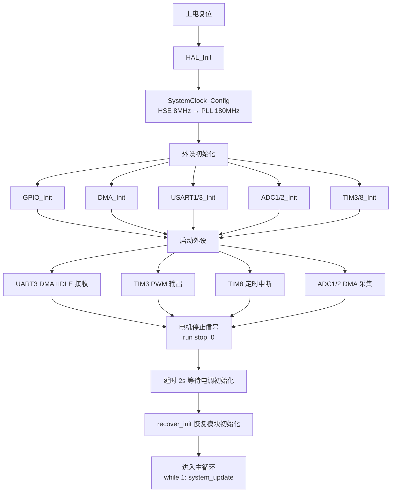
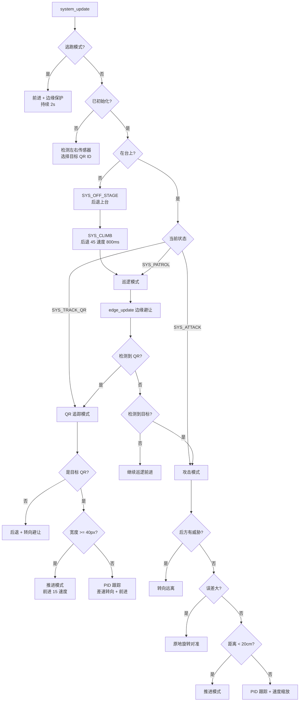
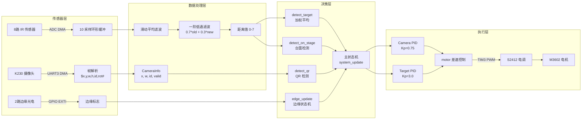
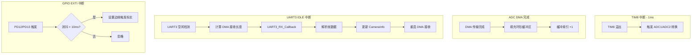
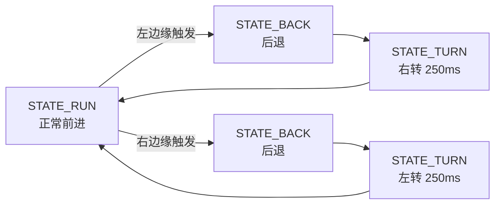

# STM32 对战机器人工程说明

## 1. 项目概述

基于 STM32F427VGT6 的自主对战机器人，采用裸机（无 RTOS）架构，通过 8 路红外传感器 + K230 摄像头实现目标检测与追踪，使用 PID 控制差速驱动完成自主攻击、巡逻、避障等行为。

## 2. 硬件平台

| 模块 | 型号/参数 |
|------|-----------|
| MCU | STM32F427VGT6 (Cortex-M4, 180MHz) |
| 电机 | M3602 有刷电机 (22.2V) |
| 电调 | S2412 (PWM 控制) |
| 红外传感器 | 8 路 IR 测距 (5-80cm) |
| 摄像头 | K230 (160×120, AprilTag 检测) |
| 边缘传感器 | 2 路光电开关 (PD12/PD13) |

## 3. 工程目录结构

```
Car_Test/
├── Core/
│   ├── Inc/              # HAL 外设头文件
│   └── Src/              # HAL 外设实现 + main.c
├── Components/BSP/       # 自定义驱动层
│   ├── system.c/h        # 主状态机 & 战斗逻辑
│   ├── motor.c/h         # 电机 PWM 控制
│   ├── sensor.c/h        # IR 传感器 ADC 采集
│   ├── camera.c/h        # K230 摄像头 UART 通信
│   ├── edge.c/h          # 边缘检测 & 防跌落
│   ├── pid.c/h           # PID 控制器
│   ├── recover.c/h       # 跌落恢复逻辑
│   └── BSP_USART.c/h     # 串口 printf 重定向
├── Drivers/              # STM32 HAL & CMSIS 库
├── K230_Code/            # K230 摄像头端 Python 代码
└── STM32F427VGT6.ioc    # CubeMX 工程文件
```

## 4. 外设分配

| 外设 | 用途 | 配置 |
|------|------|------|
| UART1 | 调试串口 | 115200, 中断接收 |
| UART3 | K230 摄像头通信 | 115200, DMA + IDLE 中断 |
| TIM3 CH1/CH2 | 电机 PWM 输出 | PSC=900, ARR=2000 (~100Hz) |
| TIM8 | 1ms 定时中断 | 触发 ADC 采样 |
| ADC1 (4ch) | IR 传感器 0-3 | DMA 循环采集 |
| ADC2 (4ch) | IR 传感器 4-7 | DMA 循环采集 |
| GPIO PD12/PD13 | 边缘光电开关 | EXTI 中断 + 10ms 消抖 |

## 5. 系统初始化流程图



## 6. 主循环状态机流程图



## 7. 数据流图



## 8. 中断服务流程



## 9. 边缘检测状态机



## 10. 关键参数一览

| 参数 | 值 | 说明 |
|------|-----|------|
| CAMERA_IMAGE_WIDTH | 160 | AprilTag 图像宽度 |
| CAMERA_PID_DEADZONE | 8 | 跟踪软死区 (像素) |
| TARGET_THRESHOLD | 40cm | IR 目标检测距离 |
| EDGE_TURN_MS | 250ms | 边缘避让转向时间 |
| RECOVER_HOLD_MS | 800ms | 跌落恢复保持时间 |
| ESCAPE_DURATION | 2000ms | 逃跑模式持续时间 |
| Camera PID | Kp=0.75, Ki=0.01, Kd=0.2 | AprilTag 跟踪 PID |
| Target PID | Kp=3.0, Ki=0.0, Kd=1.2 | 红外目标跟踪 PID |
| PWM 基准值 | 150 | 电调中位值 (100-200) |

## 11. K230 摄像头通信协议

**帧格式**: `$x,y,w,h,id,rotation#`

- `$` 帧头, `#` 帧尾
- 逗号分隔的 6 个字段
- STM32 端提取 `x`(位置), `w`(宽度), `id`(AprilTag ID)
- 有效期 100ms，超时标记为无效
